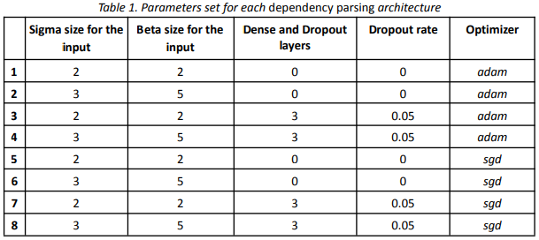
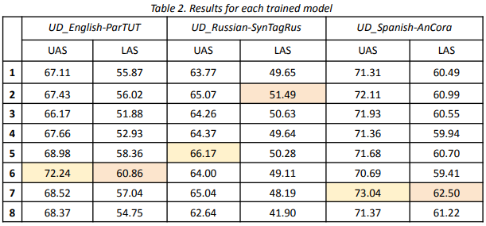

Dependency Parsing Using Arc-Eager
===

Dependency parsing is a fundamental task in Natural Language Processing (NLP) that involves analyzing the grammatical structure of a sentence and establishing relationships between "head" words and words which modify those heads. This project focuses on implementing a dependency parser using the arc-eager oracle, leveraging CoNLL-U datasets for training and evaluation. Implementation based on the work of [1].

## Dataset Description
The CoNLL-U datasets consist of sentences annotated with syntactic information, including word forms, lemmas, PoS tags, morphological features, and syntactic dependencies. These datasets are widely used for training and evaluating dependency parsers.

## Results comparison





## Install the environment in a local device
The following steps must be followed to install the dependencies required for running the application:

1. Navigate to the project directory
```
cd (`project_path`)
```

2. Create a conda environment
```
conda create -n <yourenvname> python=3.10
```

3. Install dependencies
```
pip install -r requirements.txt
```

## Execute the notebook in Google Colab
1. Upload the provided files to Google Drive (src folder) and open Google Colab.
2. Load the notebook (notebook.ipynb) and
execute cells using the button Run.

## Project Structure
The project is organized as follows:

```
├── Datasources
├── src
│   ├── conll18_ud_eval.py
│   ├── dependency_tree.py
│   ├── dp_model.py
│   ├── fileparser.py
│   ├── oracle.py
│   ├── posmodel.py
│   ├── preprocess.py
│   ├── postprocess.py
│   ├── state.py
│   ├── transition.py
│   ├── utils.py
```

## Dependencies
The main libraries used in this project include:

- Tensorflow
- Keras
- conllu
- tqdm
- InquirerPy
- matplotlib
- numpy

## Methodology
### Data Preprocessing
The data preprocessing step involves:

- Loading the CoNLL-U datasets: Reading the raw CoNLL-U files from the data/raw directory.
- Parsing the data: Extracting relevant columns such as word forms and PoS tags.
- Feature extraction: Preparing features for each word and transition state.
- Encoding labels: Converting PoS tags to numerical labels for model training.

### Arc-Eager Oracle
The arc-eager oracle is a transition-based parsing algorithm that efficiently constructs dependency trees by making a series of actions:

- LEFT-ARC (for any dependency label l): Add a dependency arc (j, l, i) to A, where i is the node on top of the stack σ and j is the first node in the buffer β. In addition, they pop the stack σ. They have as a precondition that the token i is not the artificial root node 0 and does not already have a head.
- RIGHT-ARC (for any dependency label l): Add a dependency arc (i, l, j) to A, where i is the node on top of the stack σ and j is the first node in the buffer β. In addition, they remove the first node j in the buffer β and push it on top of the stack σ. They have as a precondition that the token j does not already have a head.
- SHIFT: Move the next input word onto the stack.
- REDUCE: Combine the top elements of the stack to form dependencies.
This method is both time-efficient and suitable for real-time applications.

### Model Architecture
The model is designed with the following architecture:

- Input Layer
- Embedding layer
- Flatten layer
- Zero or more Dense Layers with ReLU activation
- Dropout Layers for each Dense Layer with a dropout rate
- Dense Layers for Computation of the two Results with ReLU activation
- Output Layers for the Transition and Relation output

### Evaluation
The evaluation step involves:

- Loading the trained model: Loading the best model checkpoint.
- Making predictions: Using the model to predict dependency structures on the test dataset.
- Calculating metrics: Evaluating the model's performance using metrics such as Unlabeled Attachment Score (UAS) and Labeled Attachment Score (LAS) using the script ```conll18_ud_eval.py```.

### References
[1] Joakim Nivre. 2008. Algorithms for Deterministic Incremental Dependency Parsing. Computational Linguistics, 34(4):513–553.